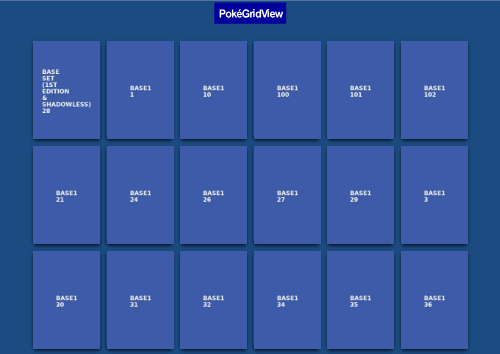

# pokegridview - Pokémon Card Gallery

Take a pokemon csv export from collectr and view locally as a gallery of images.

Note - this is a demo/experiment and some cards may need to be added manually.



**Workflow:**

1. **Collect cards:**

Use `cards.csv` exported from "Collectr" (premium required).

Example columns:

```
Portfolio Name,Category,Set,Product Name,Card Number,Rarity,Variance,Grade,Card Condition,Average Cost Paid,Quantity,Market Price,Price Override,Watchlist,Date Added,Notes
Main,Pokemon,Aquapolis,Arcanine,2,Rare,Normal,Ungraded,Near Mint,0,1,65.88,0,false,2026-03-14,
Main,Pokemon,Aquapolis,Growlithe,1,Rare,Normal,Ungraded,Near Mint,0,1,50.00,0,false,2026-03-14,
```

2. **Download images:**

Script pulls **one image per unique card** into `static/gallery/` using set + number

```
make download
```

Fill missing cards with a placeholder

```
make fill
```

Or fill missing cards with a web scrape

```
make crawl
```

3. **View gallery:** Run Flask app to generate a clean grid; click an image to fullscreen.

```
make view
```

Open your browser at:

```
http://127.0.0.1:5000/
```

